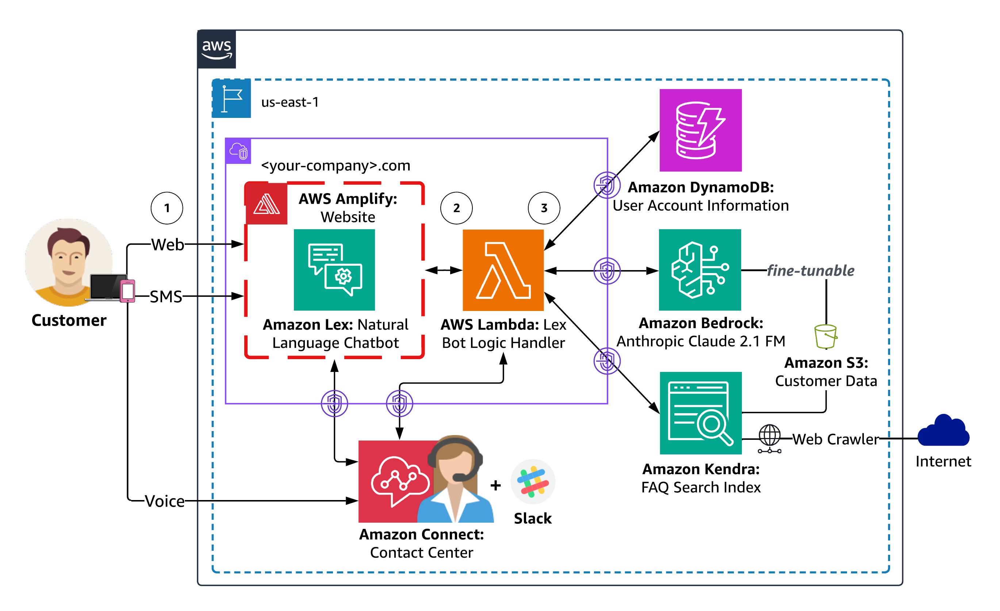
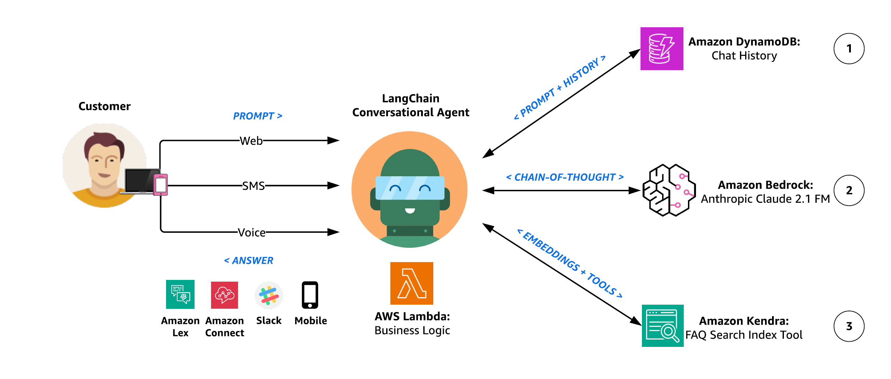

# Build generative AI agents with Amazon Bedrock, Amazon DynamoDB, Amazon Kendra, Amazon Lex, and LangChain
---

## Content
- [Overview](#overview)
- [Solution Architecture](#solution-architecture)
- [Agent Architecture](#agent-architecture)
- [Deployment Guide](#deployment-guide)
- [Testing and Validation](#testing-and-validation)
- [Clean Up](#clean-up)

## Overview
Generative AI agents are capable of producing human-like responses and engaging in natural language conversations by orchestrating a chain of calls to foundation models (FMs) and other augmenting tools based on user input. Instead of only fulfilling pre-defined intents through a static decision tree, agents are autonomous within the context of their suite of available tools. [Amazon Bedrock](https://aws.amazon.com/bedrock/) is a fully managed service that makes leading foundation models from AI companies available through an API along with developer tooling to help build and scale generative AI applications.

This sample solution creates a generative AI financial services agent powered by Amazon Bedrock. The agent can assist users with finding their account information, completing a loan application, or answering natural language questions while also citing sources for the provided answers. This solution is intended to act as a launchpad for developers to create their own personalized conversational agents for various applications, such as chatbots, virtual assistants, and customer support systems.

[Amazon Lex](https://docs.aws.amazon.com/lexv2/latest/dg/what-is.html) supplies the natural language understanding (NLU) and natural language processing (NLP) interface for the open source [LangChain conversational agent](https://python.langchain.com/docs/modules/agents/agent_types/chat_conversation_agent) within an [AWS Amplify](https://docs.aws.amazon.com/amplify/latest/userguide/welcome.html) website. The agent is equipped with tools that include an Anthropic Claude 2.1 FM hosted on [Amazon Bedrock](https://aws.amazon.com/bedrock/) and synthetic customer data stored on [Amazon DynamoDB](https://docs.aws.amazon.com/amazondynamodb/latest/developerguide/Introduction.html) and [Amazon Kendra](https://docs.aws.amazon.com/kendra/latest/dg/what-is-kendra.html).

### Demo Recording

- **Provide Personalized Responses** - Query DynamoDB for customer account information, such as mortgage summary details, due balance, and next payment date.
- **Access General Knowledge** - Harness the agent’s reasoning logic in tandem with the vast amounts of data used to pretrain the different FMs provided through Bedrock to produce replies for any customer prompt.
- **Curate Opinionated Answers** - Inform agent responses using a Kendra Index configured with authoritative data sources: customer documents stored in [Amazon Simple Storage Service (S3)](https://docs.aws.amazon.com/AmazonS3/latest/userguide/Welcome.html) and [Web Crawler](https://docs.aws.amazon.com/kendra/latest/dg/data-source-web-crawler.html/) configured for the customer's website.

## Solution Architecture

  
  <em>Diagram 1: Solution Architecture Overview</em>

1. Users perform natural dialog with the Agent through their choice of Web, SMS, or Voice channels. The Web channel includes an AWS Amplify hosted website with an Amazon Lex embedded chatbot for an example customer, Octank Financial. Each user request is processed by Lex which invokes an [AWS Lambda](https://docs.aws.amazon.com/lambda/latest/dg/welcome.html) handler for intent fulfillment. SMS and Voice channels can be optionally configured using [Amazon Connect](https://docs.aws.amazon.com/lexv2/latest/dg/contact-center.html) and [messaging integrations](https://docs.aws.amazon.com/lexv2/latest/dg/deploying-messaging-platform.html) for Amazon Lex.

   Each user request is processed by Lex to determine user intent through a process called intent recognition, which involves analyzing and interpreting the user's input (text or speech) to understand the user's intended action or purpose.

3.	Lex then invokes an [AWS Lambda](https://docs.aws.amazon.com/lambda/latest/dg/welcome.html) handler for user intent fulfillment. The Lambda function associated with the Lex chatbot contains the logic and business rules required to process the user's intent. Lambda performs specific actions or retrieves information based on the user's input, making decisions and generating appropriate responses.

4.	Lambda instruments the Financial Services agent logic as a LangChain Conversational Agent that can access customer-specific data stored on DynamoDB, curate opinionated responses using your documents and webpages indexed by Kendra, and provide general knowledge answers through the FM on Bedrock.

  	Responses generated by Kendra will include source attribution, demonstrating how you can provide additional contextual information to the agent through [Retrieval-Augmented Generation (RAG)](https://aws.amazon.com/what-is/retrieval-augmented-generation/). RAG allows you to enhance your agent’s ability to generate more accurate and contextually relevant responses using your own data.

## Agent Architecture

  
  <em>Diagram 2: LangChain Conversational Agent Architecture</em>

1. The LangChain Conversational Agent incorporates conversation memory so it can respond to multiple queries with contextual generation. This memory allows the agent to provide responses that take into account the context of the ongoing conversation. This is achieved through contextual generation, where the agent generates responses that are relevant and contextually appropriate based on the information it has remembered from the conversation.

   In simpler terms, the agent remembers what was said earlier and uses that information to respond to multiple questions in a way that makes sense in the ongoing discussion. Our agent leverages [LangChain's DynamoDB Chat Message History class](https://python.langchain.com/docs/modules/memory/integrations/dynamodb_chat_message_history) as a conversation memory buffer so it can recall past interactions and enhance the user experience with more meaningful, context-aware responses.

3.	The agent uses Anthropic Claude 2.1 on Amazon Bedrock to complete the desired task through a series of carefully self-generated text inputs known as prompts. The primary objective of prompt engineering is to elicit specific and accurate responses from the FM. Different prompt engineering techniques include:
   
       - **Zero-Shot** - A single question is presented to the model without any additional clues. The model is expected to generate a response based solely on the given question.
       - **Few-Shot** - A set of sample questions and their corresponding answers are included before the actual question. By exposing the model to these examples, it learns to respond in a similar manner.
       - **Chain-of-Thought** - A specific style of few-shot prompting where the prompt is designed to contain a series of intermediate reasoning steps, guiding the model through a logical thought process, ultimately leading to the desired answer.

    Our Agent utilizes chain-of-thought reasoning by executing a set of _Actions_ upon receiving a request. Following each _Action_, the Agent enters the _Observation_ step, where it expresses a _Thought_. If a _Final Answer_ is not yet achieved, the Agent iterates, selecting different _Actions_ to progress towards reaching the _Final Answer_.

~~~~
Thought: Do I need to use a tool? Yes
Action: The action to take
Action Input: The input to the action
Observation: The result of the action

Thought: Do I need to use a tool? No
FSI Agent: [answer and source documents]
~~~~

3. As part of the agent's different reasoning paths and self-evaluating choices to decide the next course of action, it has the ability to access synthetic customer data sources through an [Amazon Kendra Index Retriever tool](https://python.langchain.com/docs/modules/data_connection/retrievers/integrations/amazon_kendra_retriever). Using Kendra, the agent performs contextual search across a wide range of content types, including documents, FAQs, knowledge bases, manuals, and websites - Please refer to the list of [Kendra supported Data Sources](https://docs.aws.amazon.com/kendra/latest/dg/hiw-data-source.html).

   The agent has the power to use this tool to provide opinionated responses to user prompts that should be answered using an authoritative, customer-provided knowledge library, instead of the more general knowledge corpus used to pretrain the Bedrock FM.

**Sample Prompts:** 
* Why should I use Octank Financial?
* How competitive are their rates?
* Which type of mortgage should I use?
* What are current mortgage trends?
* How much do I need saved for a down payment?
* What other costs will I pay at closing?

## Deployment Guide
see [Deployment Guide](documentation/deployment-guide.md)

## Testing and Validation
see [Testing and Validation](documentation/testing-and-validation.md)

## Clean Up
see [Clean Up](documentation/clean-up.md)

---

Copyright Amazon.com, Inc. or its affiliates. All Rights Reserved.
SPDX-License-Identifier: MIT-0
