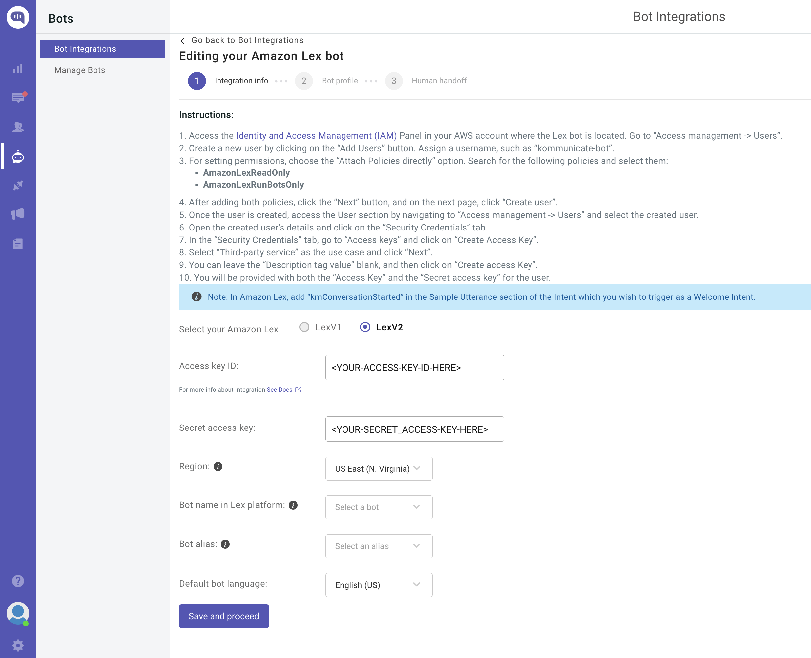
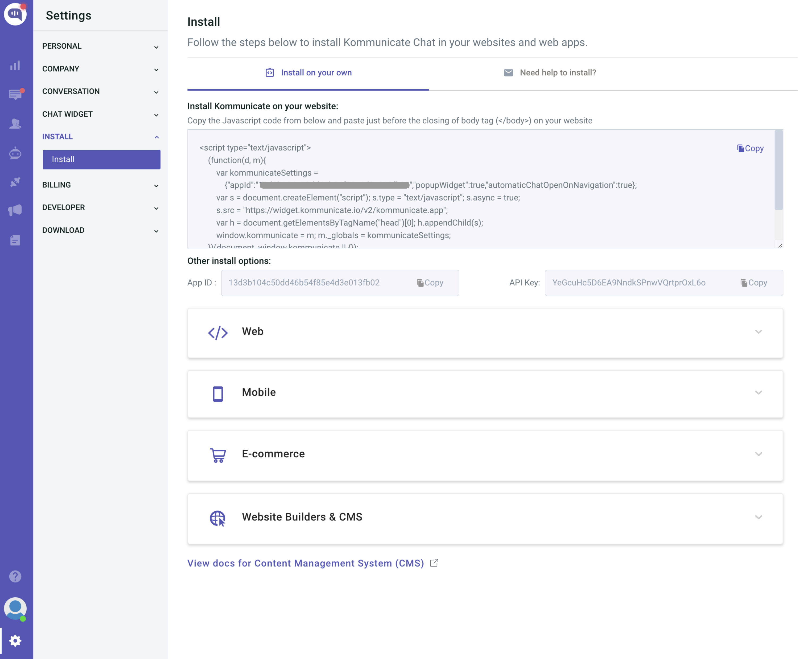

# Deployment Guide
---

## Content
- [Pre-Deployment](#pre-deployment)
- [Deployment](#deployment)
- [Post-Deployment](#post-deployment)

## Pre-Deployment
By default, AWS CloudFormation uses a temporary session that it generates from your user credentials for stack operations. If you specify a service role, CloudFormation will instead use that role's credentials.

To deploy this solution, your IAM user/role or service role must have permissions to deploy the resources specified in the CloudFormation template. For more details on AWS Identity and Access Management (IAM) with CloudFormation, please refer to the [AWS CloudFormation User Guide](https://docs.aws.amazon.com/AWSCloudFormation/latest/UserGuide/using-iam-template.html).

You must also have [AWS CLI](https://aws.amazon.com/cli/) installed. For instructions on installing AWS CLI, please see [Installing, updating, and uninstalling the AWS CLI](https://docs.aws.amazon.com/cli/latest/userguide/cli-chap-install.html).

### Fork and Clone [_generative-ai-amazon-bedrock-langchain-agent-example_](https://github.com/aws-samples/generative-ai-amazon-bedrock-langchain-agent-example) Repository
Before you deploy the solution, you need to create your own forked version of the solution repository with a token-secured webhook to automate continuous deployment of your Amplify website. The Amplify configuration points to a GitHub source repository from which our website's front-end is built.

Complete the following steps to fork and clone the [generative-ai-amazon-bedrock-langchain-agent-example](https://github.com/aws-samples/generative-ai-amazon-bedrock-langchain-agent-example.git) repository:

1. To control the source code that builds your Amplify website, follow the instructions in [Fork a repository](https://docs.github.com/en/get-started/quickstart/fork-a-repo?tool=webui&platform=mac) to fork the _generative-ai-amazon-bedrock-langchain-agent-example_ repository. This creates a copy of the repository that is disconnected from the original code base, so you can make the appropriate modifications.
2. Take note of your forked repository URL to use to clone the repository in the next step and to configure the _GITHUB_PAT_ environment variable used in the [Solution deployment automation script](deployment-automation-script).
3. Clone your forked repository using the git clone command:

```sh
git clone <YOUR-FORKED-REPOSITORY-URL>
```

### Create GitHub Personal Access Token (PAT)
The Amplify hosted website uses a [GitHub PAT](https://docs.github.com/en/enterprise-server@3.6/authentication/keeping-your-account-and-data-secure/managing-your-personal-access-tokens) as the OAuth token for third-party source control. The OAuth token is used to create a webhook and a read-only deploy key using SSH cloning.

1. To create your PAT, follow the GitHub instructions in [Creating a personal access token (classic)](https://docs.github.com/en/authentication/keeping-your-account-and-data-secure/managing-your-personal-access-tokens#creating-a-personal-access-token-classic). You may prefer to use a [GitHub App](https://docs.github.com/en/apps/creating-github-apps/creating-github-apps/about-apps) to access resources on behalf of an organization or for long-lived integrations. 

2. Take note of your PAT before closing your browser - you will use it to configure the _GITHUB_PAT_ environment variable used in the solution deployment automation script. The script will publish your PAT to [AWS Secrets Manager](https://aws.amazon.com/secrets-manager/) using [AWS Command Line Interface](http://aws.amazon.com/cli) (CLI) commands and the secret name will be used as the _GitHubToken_ [AWS CloudFormation](http://aws.amazon.com/cli) parameter.

#### Optional - Run Security Scan on the CloudFormation Templates
To run a security scan on the [AWS CloudFormation](https://docs.aws.amazon.com/AWSCloudFormation/latest/UserGuide/Welcome.html) templates using [`cfn_nag`](https://github.com/stelligent/cfn_nag) (recommended), you have to install `cfn_nag`:
```sh
brew install ruby brew-gem
brew gem install cfn-nag
```

To initiate the security scan, run the following command:
```sh
# git clone https://github.com/aws-samples/generative-ai-amazon-bedrock-langchain-agent-example
# cd generative-ai-amazon-bedrock-langchain-agent-example
cfn_nag_scan --input-path cfn/GenAI-FSI-Agent.yml
```

## Deployment 
The solution deployment automation script allows for automated solution provisioning through a parameterized CloudFormation template, [GenAI-FSI-Agent.yml](../cfn/GenAI-FSI-Agent.yml), which includes the following resources:

- An AWS Amplify website to simulate your front-end environment.
- An Amazon Lex bot configured through a bot import deployment package.
- Four DynamoDB tables:
	- _UserPendingAccountsTable_ - Records pending transactions (for example, mortgage applications).
	- _UserExistingAccountsTable_ - Contains user account information (e.g., mortgage account summary).
	- _ConversationIndexTable_ - Tracks conversation state.
	- _ConversationTable_ - Stores conversation history.
 - An S3 bucket that contains the Lambda agent handler, Lambda data loader, and Amazon Lex deployment packages, along with customer FAQ and mortgage application example documents.
 - Two Lambda functions:
	- Agent handler - Contains the LangChain conversational agent logic that can intelligently employ a variety of tools based on user input.
	- Data loader - Loads example customer account data into _UserExistingAccountsTable_ and is invoked as a custom CloudFormation resource during stack creation.
 - A Lambda layer for Amazon Bedrock Boto3, LangChain, and pdfrw libraries, built from [requirements.txt](../agent/lambda/lambda-layers/requirements.txt). The layer supplies LangChain's FM library with an Amazon Bedrock model as the underlying FM and provides pdfrw as an open source PDF library for creating and modifying PDF files.
 - An Amazon Kendra Index: Provides a searchable index of customer authoritative information, including documents, FAQs, knowledge repositories, manuals, websites, and more.
 - Two Kendra Data Sources:
	- Amazon S3 - Hosts an [example customer FAQ document](../agent/assets/AnyCompany-FAQs.csv).
	- Amazon Kendra Web Crawler - Configured with a root domain that emulates the customer-specific website (for example, _<your-company>.com_).
 - [AWS Identity and Access Management](https://aws.amazon.com/iam/) (IAM) permissions for the preceding resources.

AWS CloudFormation prepopulates stack parameters with the default values provided in the template. To provide alternative input values, you can specify parameters as environment variables that are referenced in the _`ParameterKey=<ParameterKey>,ParameterValue=<Value>`_ pairs in the below shell script's _`aws cloudformation create-stack`_ command. 

1. Before you run the shell script, navigate to your forked version of the _generative-ai-amazon-bedrock-langchain-agent-example_ repository as your working directory and modify the shell script permissions to executable:

```sh
# If not already forked, fork the remote repository (https://github.com/aws-samples/generative-ai-amazon-bedrock-langchain-agent-example) and change working directory to shell folder:
cd generative-ai-amazon-bedrock-langchain-agent-example/shell/
chmod u+x create-stack.sh
```

2. Set your Amplify repository and GitHub PAT environment variables created during the pre-deployment steps:

```sh
export AMPLIFY_REPOSITORY=<YOUR-FORKED-REPOSITORY-URL> # Forked repository URL from Pre-Deployment (Exclude '.git' from repository URL)
export GITHUB_PAT=<YOUR-GITHUB-PAT> # GitHub PAT copied from Pre-Deployment
export STACK_NAME=<YOUR-STACK-NAME> # Stack name must be lower case for S3 bucket naming convention
export KENDRA_WEBCRAWLER_URL=<YOUR-WEBSITE-ROOT-DOMAIN> # Public or internal HTTPS website for Kendra to index via Web Crawler (e.g., https://www.investopedia.com/) - Please see https://docs.aws.amazon.com/kendra/latest/dg/data-source-web-crawler.html
export AWS_REGION=<YOUR-STACK-REGION> # Stack deployment region
```

3. Finally, run the shell script to deploy the solution's resource, including the [GenAI-FSI-Agent.yml](../cfn/GenAI-FSI-Agent.yml) CloudFormation stack:

```sh
source ./create-stack.sh
```

#### Solution Deployment Automation Script
The preceding ```source ./create-stack.sh``` shell command runs the following AWS CLI commands to deploy the solution stack:

```sh
export UNIQUE_IDENTIFIER=$(uuidgen | tr '[:upper:]' '[:lower:]' | tr -d '-' | cut -c 1-5)
export S3_ARTIFACT_BUCKET_NAME=$STACK_NAME-$UNIQUE_IDENTIFIER
export DATA_LOADER_S3_KEY="agent/lambda/data-loader/loader_deployment_package.zip"
export LAMBDA_HANDLER_S3_KEY="agent/lambda/agent-handler/agent_deployment_package.zip"
export LEX_BOT_S3_KEY="agent/bot/lex.zip"

echo "STACK_NAME: $STACK_NAME"
echo "S3_ARTIFACT_BUCKET_NAME: $S3_ARTIFACT_BUCKET_NAME"

aws s3 mb s3://$S3_ARTIFACT_BUCKET_NAME --region $AWS_REGION
aws s3 cp ../agent/ s3://$S3_ARTIFACT_BUCKET_NAME/agent/ --region $AWS_REGION --recursive --exclude ".DS_Store" --exclude "*/.DS_Store"

export BEDROCK_LANGCHAIN_PDFRW_LAYER_ARN=$(aws lambda publish-layer-version \
    --layer-name bedrock-langchain-pdfrw \
    --description "Bedrock LangChain pdfrw layer" \
    --license-info "MIT" \
    --content S3Bucket=$S3_ARTIFACT_BUCKET_NAME,S3Key=agent/lambda/lambda-layers/bedrock-langchain-pdfrw.zip \
    --compatible-runtimes python3.11 \
    --region $AWS_REGION \
    --query LayerVersionArn --output text)

export CFNRESPONSE_LAYER_ARN=$(aws lambda publish-layer-version \
    --layer-name cfnresponse \
    --description "cfnresponse Layer" \
    --license-info "MIT" \
    --content S3Bucket=$S3_ARTIFACT_BUCKET_NAME,S3Key=agent/lambda/lambda-layers/cfnresponse-layer.zip \
    --compatible-runtimes python3.11 \
    --region $AWS_REGION \
    --query LayerVersionArn --output text)

export GITHUB_TOKEN_SECRET_NAME=$(aws secretsmanager create-secret --name $STACK_NAME-git-pat \
--secret-string $GITHUB_PAT --region $AWS_REGION --query Name --output text)

aws cloudformation create-stack \
--stack-name $STACK_NAME \
--template-body file://../cfn/GenAI-FSI-Agent.yml \
--parameters \
ParameterKey=S3ArtifactBucket,ParameterValue=$S3_ARTIFACT_BUCKET_NAME \
ParameterKey=DataLoaderS3Key,ParameterValue=$DATA_LOADER_S3_KEY \
ParameterKey=LambdaHandlerS3Key,ParameterValue=$LAMBDA_HANDLER_S3_KEY \
ParameterKey=LexBotS3Key,ParameterValue=$LEX_BOT_S3_KEY \
ParameterKey=BedrockLangChainPDFRWLayerArn,ParameterValue=$BEDROCK_LANGCHAIN_PDFRW_LAYER_ARN \
ParameterKey=CfnresponseLayerArn,ParameterValue=$CFNRESPONSE_LAYER_ARN \
ParameterKey=GitHubTokenSecretName,ParameterValue=$GITHUB_TOKEN_SECRET_NAME \
ParameterKey=KendraWebCrawlerUrl,ParameterValue=$KENDRA_WEBCRAWLER_URL \
ParameterKey=AmplifyRepository,ParameterValue=$AMPLIFY_REPOSITORY \
--capabilities CAPABILITY_NAMED_IAM \
--region $AWS_REGION

aws cloudformation describe-stacks --stack-name $STACK_NAME --region $AWS_REGION --query "Stacks[0].StackStatus"
aws cloudformation wait stack-create-complete --stack-name $STACK_NAME --region $AWS_REGION

export LEX_BOT_ID=$(aws cloudformation describe-stacks \
    --stack-name $STACK_NAME \
    --region $AWS_REGION \
    --query 'Stacks[0].Outputs[?OutputKey==`LexBotID`].OutputValue' --output text)

export LAMBDA_ARN=$(aws cloudformation describe-stacks \
    --stack-name $STACK_NAME \
    --region $AWS_REGION \
    --query 'Stacks[0].Outputs[?OutputKey==`LambdaARN`].OutputValue' --output text)

aws lexv2-models update-bot-alias --bot-alias-id 'TSTALIASID' --bot-alias-name 'TestBotAlias' --bot-id $LEX_BOT_ID --bot-version 'DRAFT' --bot-alias-locale-settings "{\"en_US\":{\"enabled\":true,\"codeHookSpecification\":{\"lambdaCodeHook\":{\"codeHookInterfaceVersion\":\"1.0\",\"lambdaARN\":\"${LAMBDA_ARN}\"}}}}" --region $AWS_REGION

aws lexv2-models build-bot-locale --bot-id $LEX_BOT_ID --bot-version "DRAFT" --locale-id "en_US" --region $AWS_REGION

export KENDRA_INDEX_ID=$(aws cloudformation describe-stacks \
    --stack-name $STACK_NAME \
    --region $AWS_REGION \
    --query 'Stacks[0].Outputs[?OutputKey==`KendraIndexID`].OutputValue' --output text)

export KENDRA_S3_DATA_SOURCE_ID=$(aws cloudformation describe-stacks \
    --stack-name $STACK_NAME \
    --region $AWS_REGION \
    --query 'Stacks[0].Outputs[?OutputKey==`KendraS3DataSourceID`].OutputValue' --output text)

export KENDRA_WEBCRAWLER_DATA_SOURCE_ID=$(aws cloudformation describe-stacks \
    --stack-name $STACK_NAME \
    --region $AWS_REGION \
    --query 'Stacks[0].Outputs[?OutputKey==`KendraWebCrawlerDataSourceID`].OutputValue' --output text)

aws kendra start-data-source-sync-job --id $KENDRA_S3_DATA_SOURCE_ID --index-id $KENDRA_INDEX_ID --region $AWS_REGION

aws kendra start-data-source-sync-job --id $KENDRA_WEBCRAWLER_DATA_SOURCE_ID --index-id $KENDRA_INDEX_ID --region $AWS_REGION

export AMPLIFY_APP_ID=$(aws cloudformation describe-stacks \
    --stack-name $STACK_NAME \
    --region $AWS_REGION \
    --query 'Stacks[0].Outputs[?OutputKey==`AmplifyAppID`].OutputValue' --output text)

export AMPLIFY_BRANCH=$(aws cloudformation describe-stacks \
    --stack-name $STACK_NAME \
    --region $AWS_REGION \
    --query 'Stacks[0].Outputs[?OutputKey==`AmplifyBranch`].OutputValue' --output text)

aws amplify start-job --app-id $AMPLIFY_APP_ID --branch-name $AMPLIFY_BRANCH --job-type 'RELEASE' --region $AWS_REGION
```

## Post-Deployment
In this section, we discuss the post-deployment steps for launching a front-end application that is intended to emulate the customer’s Production application. The financial services agent will operate as an embedded assistant within the example web UI.

### Launch a Web UI for Your Chatbot
[Kommunicate](https://docs.kommunicate.io/) integrates with Amazon Lex to produce a JavaScript plugin that will incorporate an Amazon Lex-powered chat widget into your existing web application. In this case, we use AWS Amplify and Kommunicate to emulate an existing customer web application with an embedded Amazon Lex chatbot.

Kommunicate only requires _AmazonLexReadOnly_ and _AmazonLexRunBotsOnly_ permissions. If you prefer not to use a third-party, the [Amazon Lex Web UI](https://aws.amazon.com/blogs/machine-learning/deploy-a-web-ui-for-your-chatbot/) can also be used to quickly provision a basic web client for Amazon Lex chatbots, although it is less feature rich.

❗ Kommunicate end user information usage: End users are defined as individuals who interact with the Lex chatbot through the Web channel. End user prompts are proxied through Kommunicate and sent to the Lex chatbot. End users may submit information such as personal information including names, email addresses, and phone numbers in the chat or connected email. Kommunicate only stores chat history and other information provided by end users for the sole purpose of displaying analytics and generating reports within the Kommunicate console, which is protected by username/password or SAML login credentials. Kommunicate does not expose the personal information of end users to any 3rd party. Please refer to [Kommunicate's privacy policy](https://www.kommunicate.io/privacy-policy) for additional information.

1. Follow the instructions for [Kommunicate's Amazon Lex bot integration](https://docs.kommunicate.io/docs/bot-lex-integration):

<p align="center">
  
</p>

2. Copy the [JavaScript plugin](https://dashboard.kommunicate.io/settings/install) generated by Kommunicate:

<p align="center">
  
</p>

3. Edit your forked version of the Amplify GitHub source repository by adding your Kommunicate JavaScript plugin to the section labeled '_<!-- Paste your Kommunicate / Lex Web UI JavaScript plugin here -->_' for each of the HTML files under the [frontend directory](../frontend/): _index.html, contact.html, about.html_:

<p align="left">
  
</p>

Amplify provides an automated build and release pipeline that triggers based on new commits to your forked repository and publishes the new version of your website to your Amplify domain. You can view the deployment status on the [Amplify Console](https://us-east-1.console.aws.amazon.com/amplify/home?region=us-east-1#/).

<p align="left">
  
</p>

You can customize your chat widget styling and greeting message in the [Kommunicate console](https://dashboard.kommunicate.io/settings/chat-widget-customization#chat-widget-styling).

<p align="left">
  
</p>

<p align="left">
  
</p>

### Access the Amplify Website
With Amazon Lex now embedded into your Amplify website, you are ready to visit your example front-end application. 

1. To access your website's domain, navigate to the CloudFormation stack's [Outputs tab](https://docs.aws.amazon.com/AWSCloudFormation/latest/UserGuide/cfn-console-view-stack-data-resources.html) and locate the Amplify domain URL. Alternatively, use the following command:

```
aws cloudformation describe-stacks \
    --stack-name $STACK_NAME \
    --query 'Stacks[0].Outputs[?OutputKey==`AmplifyDemoWebsite`].OutputValue' --output text
```

2. After you access your Amplify domain URL, you can proceed with [Testing and Validation](../documentation/testing-and-validation.md):

<p align="center">
  
</p>

## Testing and Validation
see [Testing and Validation](../documentation/testing-and-validation.md)

---

## README
see [README](../README.md)

---

Copyright Amazon.com, Inc. or its affiliates. All Rights Reserved.
SPDX-License-Identifier: MIT-0
