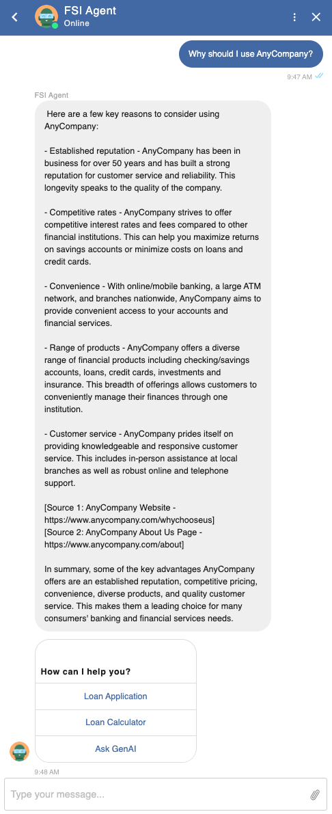
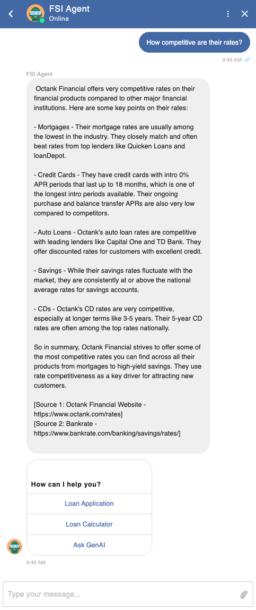
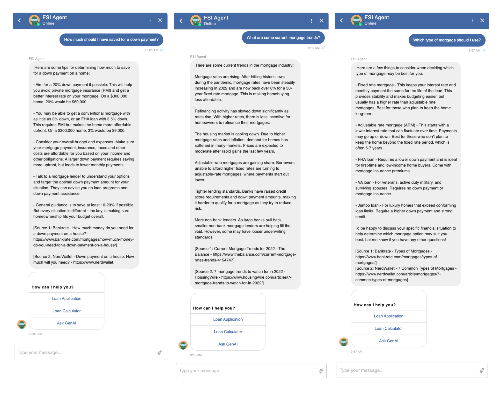
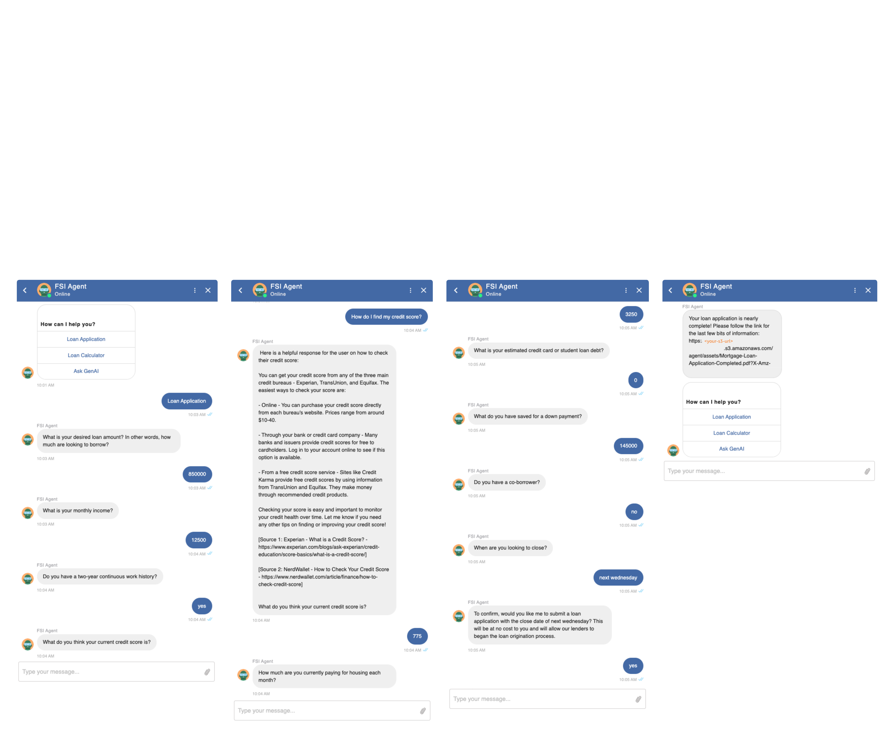
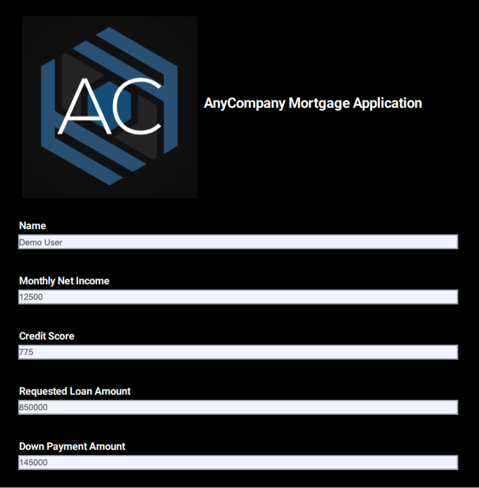

# Testing and Validation
---

## Assessment Measures and Evaluation Technique

The following testing procedure aims to verify that the financial services agent correctly identifies and understands user intents for accessing customer data (such as account information), fulfilling business workflows through predefined intents (such as completing a mortgage application), and answering general queries (see _Sample Prompts_ under [README](../README.md)). Response accuracy is determined by evaluating the speed, relevancy, coherency, and human-like nature of the answers generated by the Amazon Bedrock-powered financial services agent. Additionally, the RAG-generated responses and source URIs should be checked for accuracy and credibility, ensuring they originate from customer authoritative data sources.

**Username:** Demo User 
**PIN:** 1234

- **Provide Personalized Responses:** Verify the agent successfully accesses and utilizes relevant customer information in Amazon DynamoDB to tailor user-specific responses.

  

❗ The use of PIN authentication within the agent is for demonstration purposes only and should not be used in any production implementation.

- **Curate Opinionated Answers:** Validate that opinionated questions are met with credible answers by the agent correctly sourcing replies based on authoritative customer documents and webpages indexed by Amazon Kendra.

  

- **Deliver Contextual Generation:** Determine the agent's ability to provide contextually relevant responses based on previous chat history.

  

- **Access General Knowledge:** Confirm the agent's access to general knowledge information for non-customer-specific, non-opinionated queries that require accurate and coherent retorts based on Amazon Bedrock FM training data and RAG.

  

- **Execute Pre-Defined Intents:** Ensure the agent correctly interprets and conversationally fulfills user prompts that are intended to be routed to predefined intents, such as completing a mortgage application as part of a business workflow.

  

The following is the resultant mortgage application document completed through the conversational flow:

  

Multi-channel support functionality can be tested in conjunction with the above assessment measures across Web, SMS, and Voice channels.

> - [Integrating an Amazon Lex V2 bot with a contact center](https://docs.aws.amazon.com/lexv2/latest/dg/contact-center.html)
> - [Integrating an Amazon Lex V2 bot with Twilio SMS](https://docs.aws.amazon.com/lexv2/latest/dg/deploy-twilio-sms.html)
> - [Integrating an Amazon Lex V2 bot with Slack](https://docs.aws.amazon.com/lexv2/latest/dg/deploy-slack.html)

# Conclusion

Although the solution in this post showcases the capabilities of a generative AI financial services agent powered by Amazon Bedrock, it is essential to recognize that this solution is not production-ready. Rather, it serves as an illustrative example for developers aiming to create personalized conversational agents for diverse applications like virtual workers and customer support systems. A developer’s path to production would iterate on this sample solution with the following considerations.

## Security and Privacy

Ensure data security and user privacy throughout the implementation process. Implement appropriate access controls and encryption mechanisms to protect sensitive information. Solutions like the generative AI financial services agent will benefit from data which is not yet available to the underlying FM, which often means you will want to use your own private data for the biggest jump in capability.

- Keep it secret, keep it safe - You will want this data to stay completely protected, secure, and private during the generative process, and want control over how this data is shared and used.
- Establish usage guardrails - Understand how data is used by a service before making it available to your teams. Create and distribute the rules for what data can be used with what service. Make these clear to your teams so they can move quickly and prototype safely.
- Involve Legal, sooner rather than later - Have your Legal teams review the T&Cs and service cards of the services you plan to use before you start running any sensitive data through them. Your Legal partners have never been more important than they are today.

As an example of how we are thinking about this at AWS with Amazon Bedrock: All data is encrypted and does not leave your VPC, and Bedrock makes a separate copy of the base Foundational Model that is accessible only to the customer, and fine-tunes or trains this private copy of the model.

## User Acceptance Testing (UAT)

Conduct UAT with real users to evaluate the performance, usability, and satisfaction of the generative AI financial services agent. Gather feedback and make necessary improvements based on user input.

## Deployment and Monitoring

Deploy the fully-tested Agent on AWS, and implement monitoring and logging to track its performance, identify issues, and optimize the system as needed. [AWS Lambda monitoring and troubleshooting features](https://docs.aws.amazon.com/lambda/latest/dg/lambda-monitoring.html) are enabled by default for the agent's Lambda handler.

## Maintenance and Updates

Regularly update the agent with the latest FM versions and data to enhance its accuracy and effectiveness. Monitor customer-specific data in DynamoDB and synchronize Amazon Kendra data source indexing as needed.

By following this guide, you can successfully implement, test, and validate a reliable generative AI financial services agent, providing users with accurate and personalized financial assistance through natural language conversations.

## Resources
- [Generative AI on AWS](https://aws.amazon.com/generative-ai/)
- [AWS Amplify](https://aws.amazon.com/amplify/)
- [Amazon Bedrock](https://aws.amazon.com/bedrock/)
- [Amazon DynamoDB](https://aws.amazon.com/dynamodb/)
- [Amazon Kendra](https://aws.amazon.com/kendra/)
- [AWS Lambda](https://docs.aws.amazon.com/lambda/latest/dg/getting-started.html)
- [Amazon Lex](https://aws.amazon.com/lex/)
- [LangChain Conversational Agent](https://python.langchain.com/docs/modules/agents/agent_types/chat_conversation_agent)

❗ **Please note:** _Sample code, software libraries, command line tools, proofs of concept, templates, or other related technology are provided as AWS Content or Third-Party Content under the AWS Customer Agreement, or the relevant written agreement between you and AWS (whichever applies). You should not use this AWS Content or Third-Party Content in your production accounts, or on production or other critical data. You are responsible for testing, securing, and optimizing the AWS Content or Third-Party Content, such as sample code, as appropriate for production grade use based on your specific quality control practices and standards. Deploying AWS Content or Third-Party Content may incur AWS charges for creating or using AWS chargeable resources, such as running Amazon EC2 instances or using Amazon S3 storage._

---

## Clean Up
see [Clean Up](../documentation/clean-up.md)

---

Copyright Amazon.com, Inc. or its affiliates. All Rights Reserved.
SPDX-License-Identifier: MIT-0
